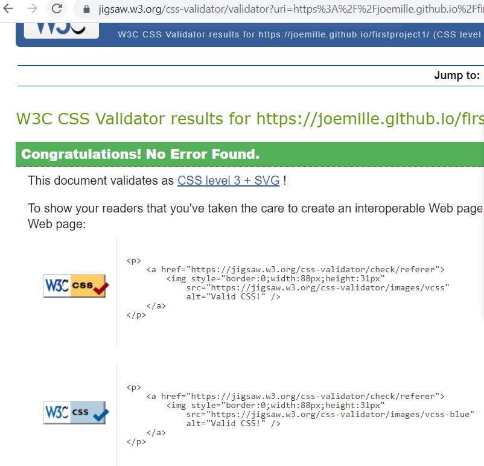
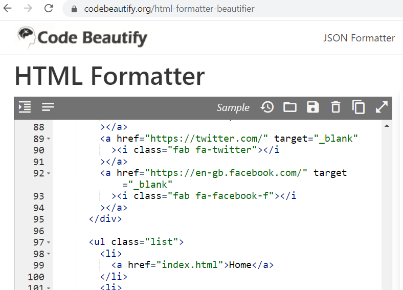
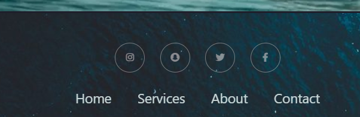
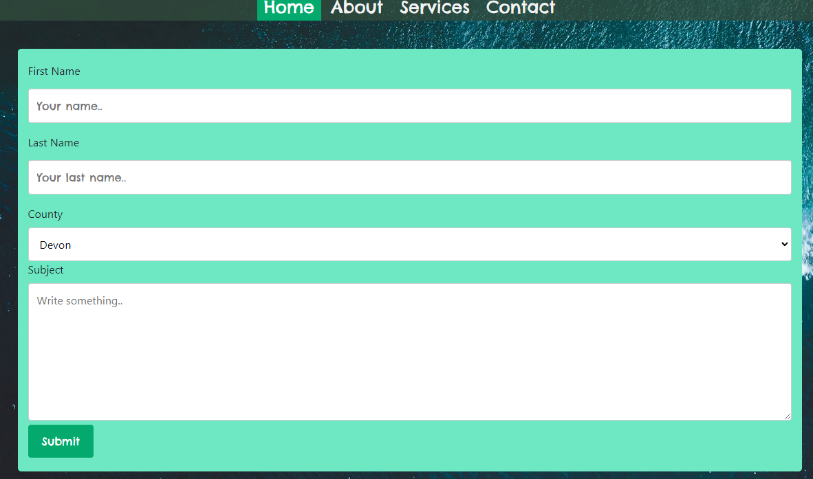
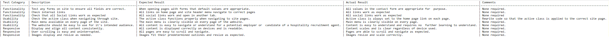

# The Coastal Chef Project

This is a website for recruiting temporary chef hire in the Southern English Coastal Region.

## Description

This project was built as a false page for a fictional recruitment company based in the South of England. 
Having been a client for multiple Hospitality Staffing agencies for large restaurants and Hotels, the idea for the 
project was to create a page that quickly communicated it's intent and services without want for further explanation.

Using code from Code Institue challenges and lessons, W3 lessons and examples, and other forum resources, the final site has; 
banner and background images with CSS styling, navigation menus, headers with images, footers with social media and home navigation links.

The biggest challenges faced when creating this site were time-related and technical, such as getting images to fit text boxes, the padding between sections and headers, and ultimately losing work often due to lack of understanding. Starting again from scratch with code saved in external text editors and reworking whilst also doing Code Institute examples of similar errors and problems alongside the milestone project, cleared most roadblocks.

## User Stories

As a chef of over a decade with much experience in navigating overly complex websites for hospitality recruitment, the goals of this website were:

1. Provide an easy to understand platform for contact and service explanation.
2. Have an in built contact form so no need for copying and pasting phone numbers or email addresses.
3. Make the services provided obvious, unecessary complication of a job role makes finding the right candidate a chore.
4. Images and background images that lightly allude to the websites purpose and fit in with the coastal aesthetic.
5. Make sure the location and catchment area of the agency is clealry obvious so as not to invite unwanted traffic.

As a candidate for many hospitality agencies when working free lance and temporary assignment, the main purposes of the Coastal Chef:

1. Write service and job descriptions that are easy to communicate and understand.
2. Make the agency location easily explained so chefs in other parts of the country don't waste time contacting or applying.
3. Deliver an easy to navigate website that people with low computer literacy can click through and engage with.
4. Provide images of fine-dining plates to reinforce a quality standard.
5. Make the contact form non-specific to candidate or employer. 

## Design Choices

The main purpose of the design of the website is to incorporate coastal/nautical aesthetics and provide images/fonts/icons that also embody those themes, as well making it crystal clear that this is a page solely directed towards hospitality candidates and employers.

* The main font used is Square Peg which seemed the best fit due to it's somewhat temprary paint-brush style.
* Images used on the site all maintain a coastal style including the food images.
* Common industry abbreviation is used in the text describing services and about sections.
* A brief history of the owner embodies a pretty typical back story to the majority of industry operated recruitment agencies

## Testing

After my first submission of this project falling short of expectations I began to try and clean up some of the code and re-organising my project, managing to score higher and higher.

The W3c Validator was used to validate the CSS, as well as the HTML. After clearing up some of the highlighted issues in the initial submission the code runs smoothly.  

The code beautifying tool from codebeautify.org was used to format the HTML which after comparing the former from latter was a helpful tool in understanding how to better my writing in the future.

The purpose of this site is to provide an easy to navigate format for understanding the company's purpose and being able to contact and engage with them on social media links, which although don't link to any specific social pages function properly.

The Home Page features a basic landing page with a background image and title, allowing navigation
to the other site pages. 

The About Page contains a few short descriptive paragraphs about the services provided by the fictional Coastal Chef Project.
With there being thousands of potential recruitment agencies catering to the hospitality industry, use of brief and concise text 
rather than long paragraphs filled with boiler plate information on the trade was added.

The contact form was borrowed from a w3 Schools lesson on building contact boxes in HTML and CSS alone. 

Although far from how the site was initially intended to be published, the critical features are all involved and navigation throughout is easy, allowing any hospitality sector employer or candidate to find what they're looking for without any further instruction. 

 
Functionality, usability and responsiveness tests were carried out to make sure the site worked properly. These tests included: 
* Testing forms to ensure all default fields were correct.
* Checking internal links.
* Checking social navigation links.
* Checking the active class when navigating through the site. 
* Making sure the main menu was available on every page.
* Making sure the website was easy to use for it's intended audience.
* That all content displays and aligns correctly.
* User scrolling is easy and uninterrupted.
* Images display and resize as needed.

### Environment Testing 

Upon my first submission, pages across the site were failing to interact with stylesheet code. This led to all content being bland and without images and the back two pages having literally no styling. After realising my error, the code in the heading was changed so that all pages interacted simultaneously with the stylesheet, leading to a far superior website experience. 
Images were then changed adding to a more pleasing aesthetic which coincided coastal and ocean themes, with pictures of food that aren't too jarring to the readers visuals.

## Deployment (further)

This project is available to be cloned and ammended as well as improved upon.

To clone this project you will need:

* Github and a Github account.
* A working internet connection.

To ammend or add to The Coastal Chef, follow these simple steps:

* Sign into your Gitpod account
* Navigate to the Coastal Chef repository.
* Beneath the repository name, click on the "Clone" option, which will open a new Gitpod workspace.
* Inside your terminal, type "git clone", add the Coastal Chef URL and Press Enter.
 

## Summary

The final version of the website is a far cry from the original design, utilising the time made for resubmission attempts it was important to make the content easier to digest and hopefully more aesthetic to the prospective user. Improper coding practices have been removed, styling works across all pages, images used are more consistent and non-jarring to viewers. This site is designed to allow hospitality employers and candidates to navigate with ease and obtain information without need for further instruction. 

## Author

Joe Miller  

ChefJoeMiller1992@gmail.com

## Acknowledgments

* [awesome-readme](https://github.com/matiassingers/awesome-readme)
* [W3 Schools](https://www.w3schools.com/css)
* [Code Institute](https://learn.codeinstitute.net/)
* [Stack Overflow](https://stackoverflow.com/questions)
* [Free Code Camp](https://www.freecodecamp.org/)
* [Code Beautify] (https://codebeautify.org/)

## Libraries used
* Bootstrap
* Font-Awesome
* Google Fonts

