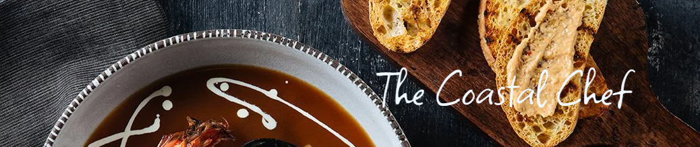
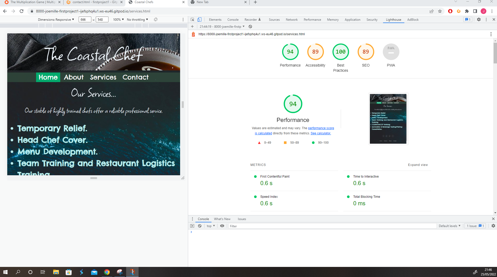
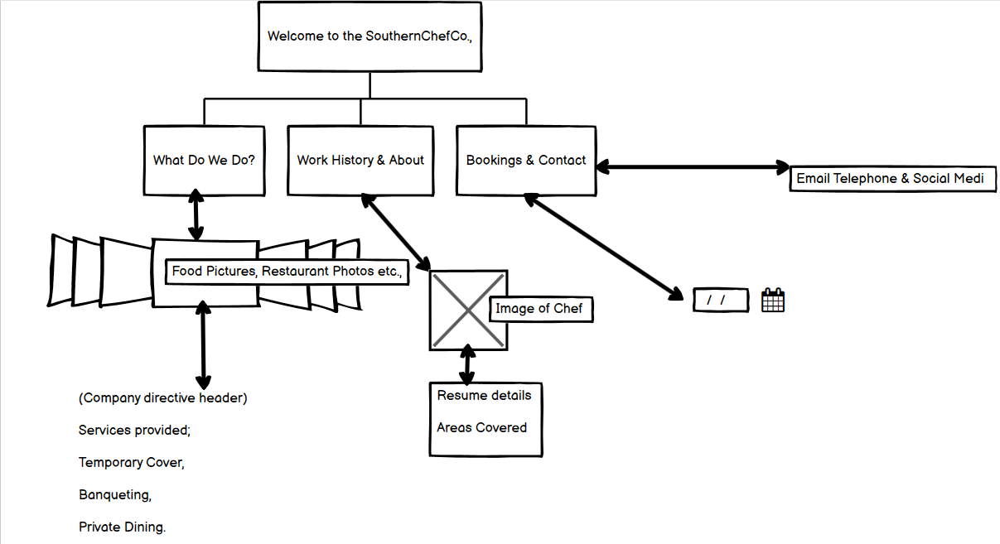

## The Coastal Chef Project

This is a website for recruiting temporary chef hire in the Southern English Coastal Region.

## Description

This project was built as a false page for a fictional recruitment company based in the South of England. 
Having been a client for multiple Hospitality Staffing agencies for large restaurants and Hotels, the idea for the 
project was to create a page that quickly communicated it's intent and services without want for further explanation.

The Home Page features a basic landing page with a background image and title, allowing navigation
to the other site pages. 

The About Page contains a few short descriptive paragraphs about the services provided by the fictional Coastal Chef Project.
With there being thousands of potential recruitment agencies catering to the hospitality industry, use of brief and concise text 
rather than long paragraphs filled with boiler plate information on the trade was added. 

Using code from Code Institue challenges and lessons, W3 lessons and examples, and other forum resources, the final site has; 
banner and background images with CSS styling, navigation menus, headers with images, footers with social media and home navigation links.

The biggest challenges faced when creating this site were time-related and technical, such as getting images to fit text boxes, the padding between sections and headers, and ultimately losing work often due to lack of understanding of commit messages and using Git Templates. Starting again from scratch with code saved in external text editors and reworking whilst also doing Code Institute examples of similar errors and problems alongside the milestone project, cleared most roadblocks.  
After my first submission of this project falling short of expectations I began to try and clean up some of the code, as per my assessor's helpful advice I started by using Google Lighthouse developer tool and after re-organising my project managed to score higher and higher.

The purpose of this site is to provide an easy to navigate format for understanding the company's purpose and being able to contact and engage with them on social media links, which although don't link to any specific social pages function properly. 

The contact form was borrowed from a w3 Schools lesson on building contact boxes in HTML and CSS alone. 

Pivotal to finally understanding a lot of the issues I had been facing on the numerous first attempts made and lost was finally learning how to commit properly a critical mistake that cost weeks and weeks of work that was then compressed into a far shorter than hoped window to meet project dead line. 

The final product was far from what had been initially planned, having removed much of the unnecessary information from sketches, with much of the planned interactivity being past my understanding at the time of production, the site pages now all engage with their styling and some of the messy writing from first submission has either been altered or removed. 

The W3c Validator was used to validate the CSS, as well as the HTML. After clearing up some of the highlighted issues in the initial submission the code runs smoothly.  

The code beautififying tool from codebeautify.org was used to the format the HTML which after comparing the former from the latter was a helpful tool in understainding how to better my writing in the future.

When imagining the first submission of my very first milestone project, it was far from what was produced. Insanely basic errors like not understanding commit messages, losing work time and again, not linking stylesheet to html files, poorly chosen images and a poorly written README file as well as countless others were ample obstacles to try and overcome. After over a decade working in a completely different environment, with none but essential communication deemed necessary, even engaging on Slack and online forums with other students and tutors seemed almost an impossible mountain to climb. Although far from what I had imagined, I'm entirely thankful to the process for highlighting just how difficult even basic web design is. From all shortcomings, errors and oversights it's shone a light on what attributes of development I'd like to become far more proficient at, and also helped me realise that if I can work as hard at development as I had to work learning to perform in my current professional domain, that I will have ample fuel to jump into this next chapter of my professional life well-equipped.   

## Author

Joe Miller  

ChefJoeMiller1992@gmail.com

## Acknowledgments

* [awesome-readme](https://github.com/matiassingers/awesome-readme)
* [W3 Schools](https://www.w3schools.com/css)
* [Code Institute](https://learn.codeinstitute.net/)
* [Stack Overflow](https://stackoverflow.com/questions)
* [Free Code Camp](https://www.freecodecamp.org/)
* [Code Beautify] (https://codebeautify.org/)

## Libraries used
* cdn.jsdeliver.net
* cdnjs.cloudflare.com
* fonts.googleapis.com
* fonts.gstatic.com
* maxcdn.bootstrapcdn.com
